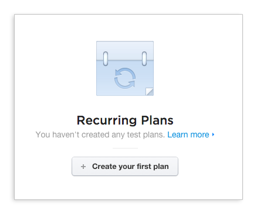
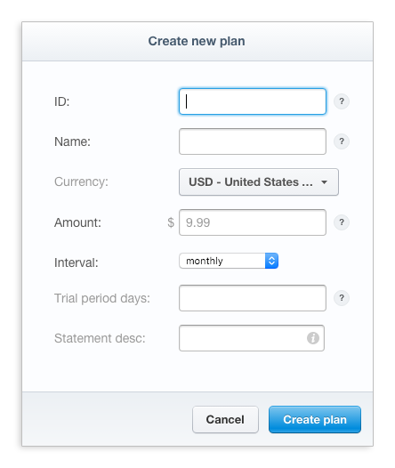

# Getting Started

Adding Stripe integration to your Django project can be done in 3 painless
steps, less if you use the Pinax starter project.

!!! tip "Pinax Starter Project for Stripe"

    If you choose this route, then you can skip the rest of the steps in this
    guide. After running `pip install pinax-cli` just run
    `pinax start stripe <project name>` and follow the instructions in the
    README of the project that is created.

## Installation

To install simply run:

    pip install pinax-stripe

## Configuration

### Settings

There are only three required settings (four if setting up subscriptions) you
need to configure:

* Installed Apps (`INSTALLED_APPS`)
* Stripe Keys (`PINAX_STRIPE_PUBLIC_KEY` and `PINAX_STRIPE_SECRET_KEY`)
* Default Plan (`PINAX_STRIPE_DEFAULT_PLAN`)

See the [settings and configuration](settings.md) docs for more of what's
available to customize your integration.

#### Installed Apps

    # settings.py
    INSTALLED_APPS = (
        ...
        "django.contrib.sites",
        ...
        "pinax.stripe",
    )

#### Set `SITE_ID` for the `Sites` framework

    # settings.py
    SITE_ID = 1
    
#### Creating the `pinax-stripe` database tables

`pinax-stripe` stores a cache of some Stripe data locally, so you need to run the included migrations to set up the new tables. Just run:

    ./manage.py migrate

#### Stripe Keys

Your Stripe keys are what authorize the app to integrate with your Stripe
account.  You can find your keys the Stripe account panel (see screenshots):

It's a good idea not to commit your production keys to your source repository
as a way of limiting access to who can access your Stripe account.  One way of
doing this is setting environment variables where you deploy your code:

    # settings.py
    PINAX_STRIPE_PUBLIC_KEY = os.environ.get("STRIPE_PUBLIC_KEY", "your test public key")
    PINAX_STRIPE_SECRET_KEY = os.environ.get("STRIPE_SECRET_KEY", "your test secret key")

This will use the environment variables `STRIPE_PUBLIC_KEY` and
`STRIPE_SECRET_KEY` if they have been set. Otherwise what you set in the second
parameter will be used.

#### Default Plan

If you are using `pinax-stripe` for something like a Software-as-a-Service
site with subscriptions, then you will want to also set the Stripe ID for a
`PINAX_STRIPE_DEFAULT_PLAN` setting and install middleware. See the
[SaaS Guide](../user-guide/saas.md) for more details about working with
subscriptions.

### Urls and Views

If you want to use the [default views](../reference/views.md) that ship with
`pinax-stripe` you can simply hook up the urls:

    # urls.py
    url(r"^payments/", include("pinax.stripe.urls")),

However you may only want to hook up some of them or customize some and hook up
each url individually. Please see the [urls](../reference/urls.md) docs for more
details.

## Syncing Data

The data in `pinax-stripe` is a cache of the data you have in your Stripe
account.  The one exception to this is the `pinax.stripe.models.Customer` model
that links a Stripe Customer to a user in your site.

!!! note

    The reason for this exception is because of the need to link the Stripe
    data to users in your application. This is done through a one to one
    relationship (a `Customer` can only belong to a single `User` and a `User`
    can only have a single `Customer` reference).

### Syncing Plans

If you are using subscriptions you'll want to setup your plans in your Stripe
account:

and then run:

    ./manage.py sync_plans

### Initializing Customers

If you already have users in your site and are adding payments and/or
subscription capabilities and want to create a customer for every user in your
site, you'll want to do two things:

First setup, handle new users being created in your site either in a sign up
view, a signal receiver, etc., to run:

    from pinax.stripe.actions import customers
    customers.create(user=new_user)

Then, to update your Stripe account after your initial deploy of a site with
existing users:

    ./manage.py init_customers

!!! note "Note"

    This is not required and you may choose to only create customers
    for users that actually become customers in the event you have a mix of users
    and customers on your site.

### Syncing Customer Data

In the event, you need to update the local cache of data for your customers,
you can run:

    ./manage.py sync_customers

## Testing Webhooks Locally

Since the Stripe integration is driven largely by webhooks you'll need to
configure a port forwarder to give you a public URL to route requests to
your local `runserver`.

[ngrok](https://ngrok.com/) has been a great tool that is easy to get going,
but you can use whatever you want. Here is how to use `ngrok`:

    ngrok http 8000  # assuming you are running runserver with the default 8000 port

Copy and paste the url that ngrok outputs that it's mapping to your local
machine, into your webhook settings in the Stripe dashboard account settings.
Make sure the webhook URL appended to the end:

    http://<random code>.ngrok.io/payments/webhook/

Now when you do activities locally like subscribe, change payment methods, etc.,
the webhooks will flow back to your machine.
