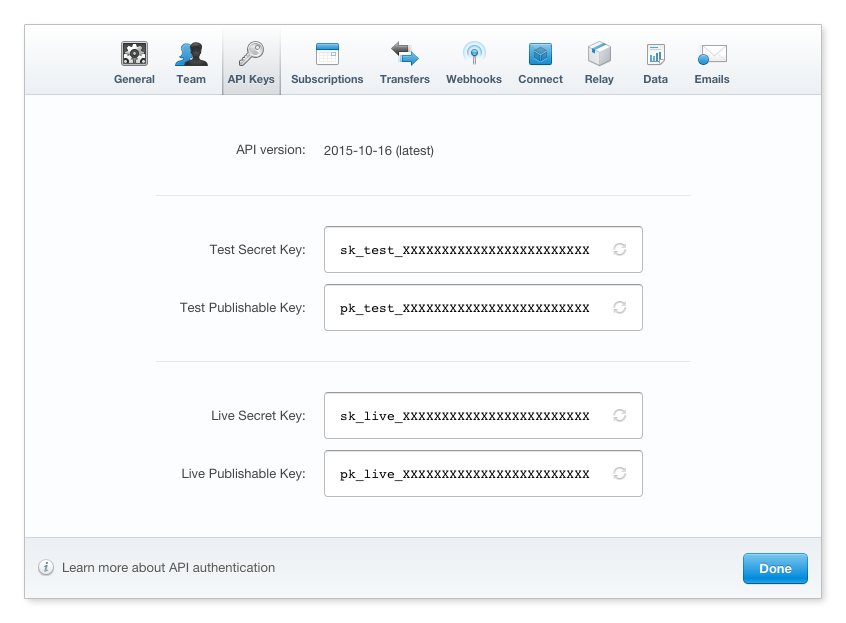

# Settings & Configuration

## Settings

### PINAX_STRIPE_PUBLIC_KEY

**Required**

This is the Stripe "publishable" key. You can find it in your Stripe account's
[Account Settings panel](#stripe-account-settings-panel).


### PINAX_STRIPE_SECRET_KEY

**Required**

This is the Stripe "secret" key. You can find it in your Stripe account's
[Account Settings panel](#stripe-account-settings-panel).


### PINAX_STRIPE_API_VERSION

Defaults to `"2015-10-16"`

This is the API version to use for API calls and webhook processing.


### PINAX_STRIPE_INVOICE_FROM_EMAIL

Defaults to `"billing@example.com"`

This is the **from** address of the email notifications containing invoices.


### PINAX_STRIPE_DEFAULT_PLAN

Defaults to `None`

Sets a default plan and is used if you have a scenario where you want to
auto-subscribe new users to a plan upon signup.


### PINAX_STRIPE_HOOKSET

Defaults to `"pinax.stripe.hooks.DefaultHookSet"`

Should be a string that is a dotted-notation path to a class that implements
[hookset](#hooksets) methods as outlined below.


### PINAX_STRIPE_SEND_EMAIL_RECEIPTS

Defaults to `True`

Tells `pinax-stripe` to send out email receipts for successful charges.


### PINAX_STRIPE_SUBSCRIPTION_REQUIRED_EXCEPTION_URLS

Defaults to `[]`

A list of URLs to exempt from requiring an active subscription if the
`pinax.stripe.middleware.ActiveSubscriptionMiddleware` is installed.


### PINAX_STRIPE_SUBSCRIPTION_REQUIRED_REDIRECT

Defaults to `None`

The URL of where to redirect requests to that are not from a user with an
active subscription if the `pinax.stripe.middleware.ActiveSubscriptionMiddleware`
is installed.


## Stripe Account Settings Panel




## HookSets

A HookSet is a design pattern that allows the site developer to override
callables to customize behavior. There is some overlap with Signals but they
are different in that these are called directly and executed only once per
call rather than going through a dispatch mechanism where there is an
unknown number of receivers.

There are currently three methods on the `DefaultHookSet` than you can
override. You do this by inheriting from the default and implementing the
methods you care to change.

```python
# mysite/hooks.py
from pinax.stripe.hooks import DefaultHookSet

class HookSet(DefaultHookSet):

    def adjust_subscription_quantity(self, customer, plan, quantity):
        """
        Given a customer, plan, and quantity, when calling Customer.subscribe
        you have the opportunity to override the quantity that was specified.
        """
        return quantity

    def trial_period(self, user, plan):
        """
        Given a user and plan, return an end date for a trial period, or None
        for no trial period.
        """
        return None

    def send_receipt(self, charge):
        pass
```

```python
# settings.py
PINAX_STRIPE_HOOKSET = "mysite.hooks.HookSet"
```
